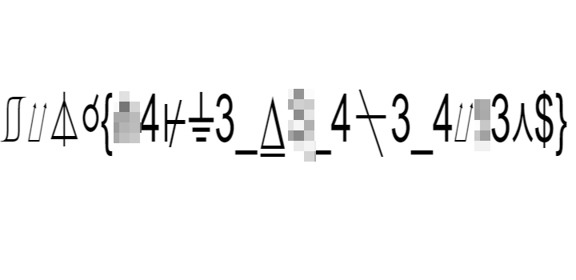
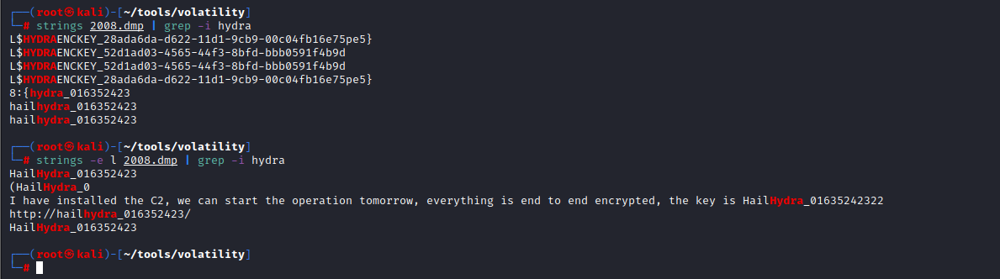
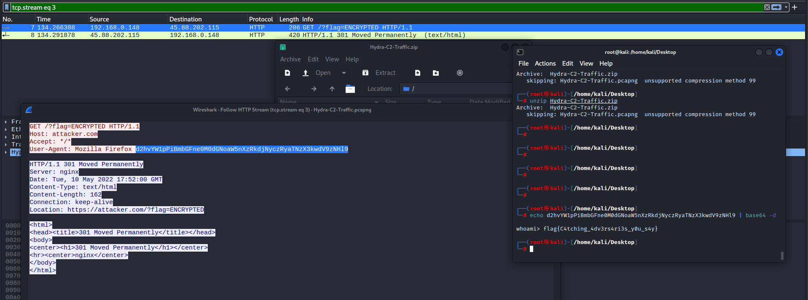
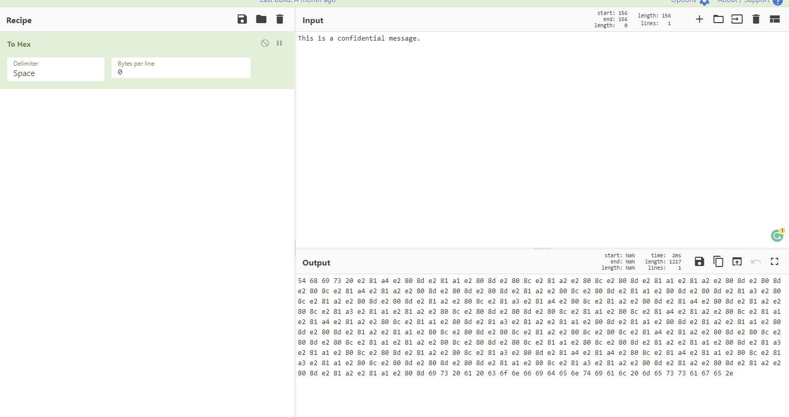
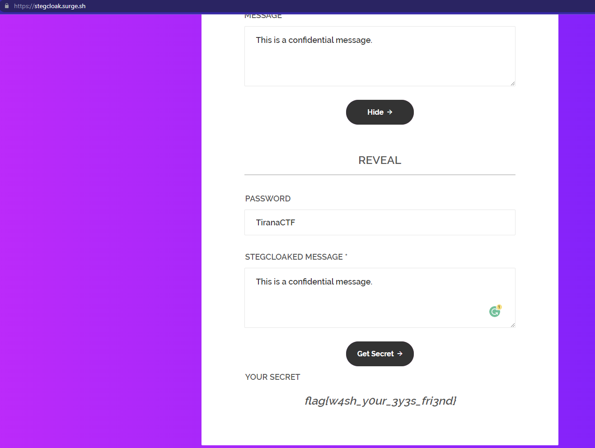

# Creature

Image shows some not common symbols
a quick google reverse image search revelas alien language 




# Hydra

A Memory Dump and a Zip File

Zip needs a password which can be retireved by analyzing the memory .dmp

First you need to use volatility to dump the notepad.exe process memory and use strings

```
# volatility -f test.raw pslist | grep notepad
Volatility Foundation Volatility Framework 2.6
0x85872b18 notepad.exe 2796 2168 5 81 1 0 2018-03-01 14:01:51 UTC+0000

```

```
# volatility -f test.raw memdump --dump-dir=./ -p 2796
Volatility Foundation Volatility Framework 2.6
************************************************************************
Writing notepad.exe [ 2796] to 2796.dmp
```




Using the extracted password it's possible to access the pcap file inside the zip archive


Basic analyze of the HTTP traffic can reveal the flag

# Plain Sight

2 files exist

* key.txt
* secret.txt


secret.txt only shows a short sentence, but it contains more than that, it contains hidden characters, using an hex editor it will be visible




Using https://stegcloak.surge.sh/ it's possible to get the flag



