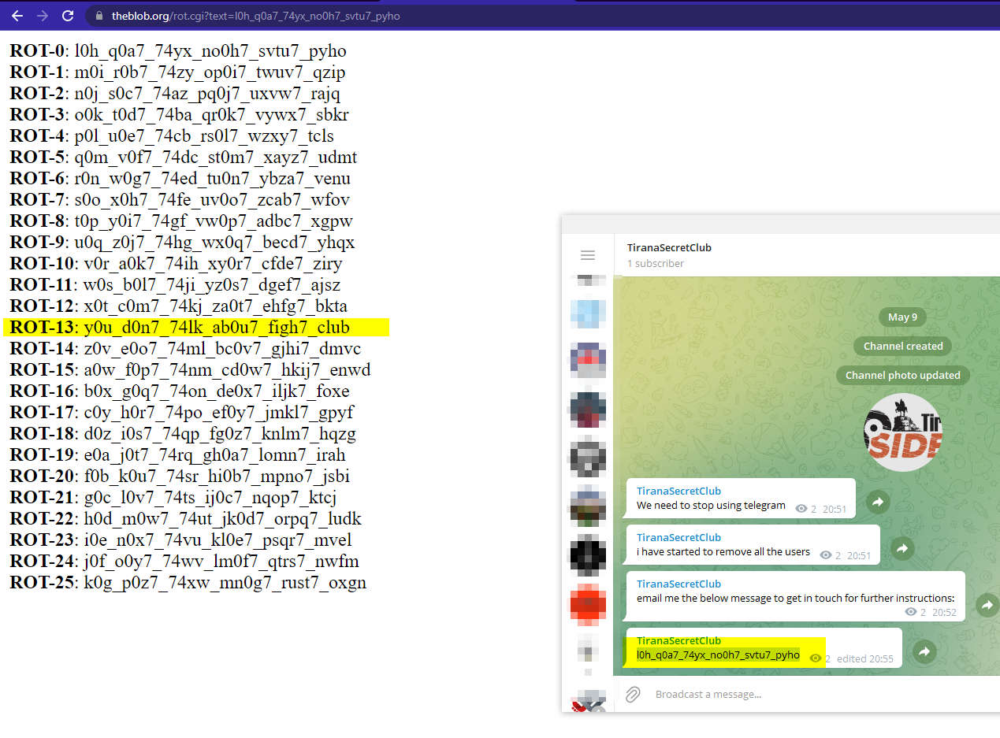
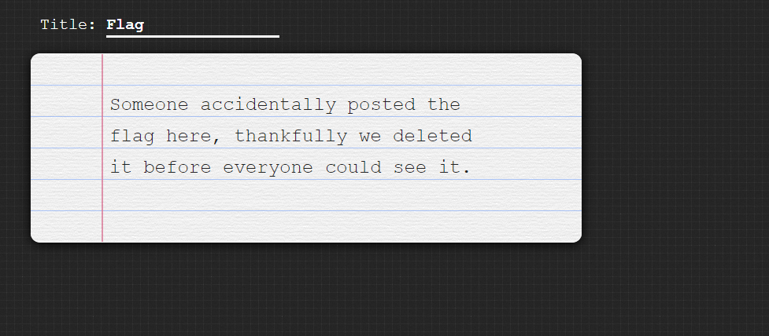
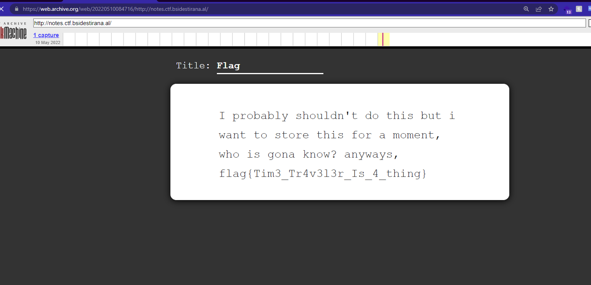

# Club

Using tools such as `sherlock` it's possible to enumerate all social medias for the provided username **tiranauser**

# Launch

Again using sherlock and searching for the username it's possible to find a github account, taking a look at the last repository (has the word launch in it)

One of the commits mentions `Increased Security` and removes the flag

# Notes

Visiting the page indicates there used to be something in the page was not supposed to be

Getting help from https://archive.org/ can go back in time and visit the old page containing the flag

