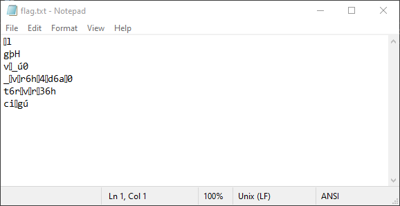

# Developer

Idea from Welcome-CTF

this challenge is easy, a js file containing the flag, divided to chunks, manual work is involved to retireve the flag

# Neo

Triggering Change Flag

Says there is something missing

Monnitor File-System Calls using procmon revelas the app is trying to open a handle to a file at temp called `matrix.key` but it does not exist

Manual creation of this file results in below result (Win)

# Encryptor

Encrypor.exe & flag.txt

flag.txt has been changed

Encryptor.exe accept a file as input and transforms the file

Transformation mechanism is simple, each character XORed with the same character + 10

