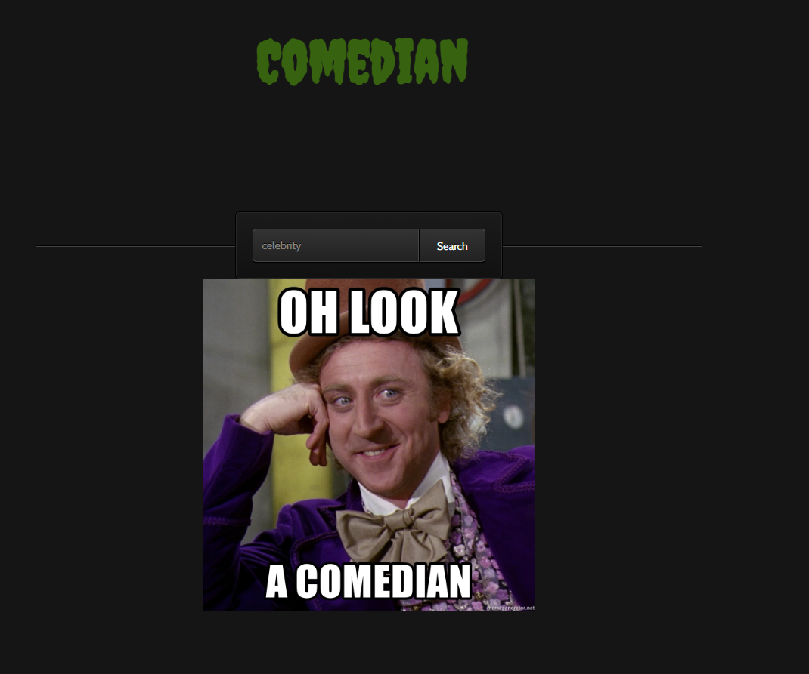

# BSides Tirana 2022 Web Challenges & Solutions


### Insider

This is a web app to detect burp suite (for real?!)
Upon Visiting the page, the user will be presented with a alert saying "Don't Cheat" (If browser is proxied through burp)

the jquery has been modified and a snippet of code has been added to detect `http://burp/favicon.ico`, since by default, burp suite will be listening at that address, if the image load is successful that means the browser is being proxied through burp and user recived the mssage saying `Don't Cheat` and a `logo.png` gets loaded and if there is no burp, then a `logo.jpg` gets loaded


Requesting logo.jpg will result in `Good: BASE64-Flag`


 


### Comedian

The web app allows you to serch for jokes



Clicking on the image takes us to another url that says you are not the joke master


Because it is checking for the src-addr to be from local host


the jokes are retirved from a 3rd-party website


The path is not controllable, only the host is controllable


It's possible to send the Comedian to attacker controlled website, hosting a index.php to send a 302 redirect (gaining control over full url) sending comedian to jokemaster (127.0.0.1) to retrieve the flag


```
<?php

header('Location: http://localhost/jokemaster')

?>
```


